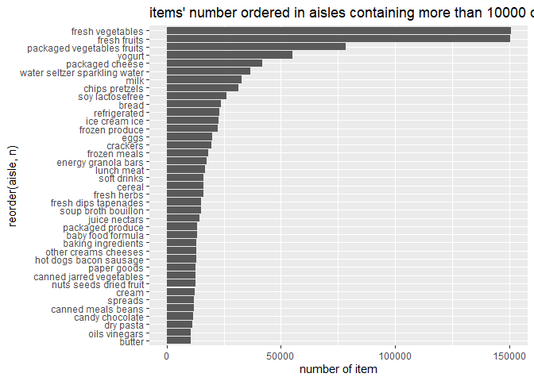

p8105\_hw3\_xl2934
================
Xiaoyang Li
2019/10/6

# Problem 1

``` r
# load data
library(p8105.datasets)
data("instacart")

str(instacart)
```

    ## Classes 'tbl_df', 'tbl' and 'data.frame':    1384617 obs. of  15 variables:
    ##  $ order_id              : int  1 1 1 1 1 1 1 1 36 36 ...
    ##  $ product_id            : int  49302 11109 10246 49683 43633 13176 47209 22035 39612 19660 ...
    ##  $ add_to_cart_order     : int  1 2 3 4 5 6 7 8 1 2 ...
    ##  $ reordered             : int  1 1 0 0 1 0 0 1 0 1 ...
    ##  $ user_id               : int  112108 112108 112108 112108 112108 112108 112108 112108 79431 79431 ...
    ##  $ eval_set              : chr  "train" "train" "train" "train" ...
    ##  $ order_number          : int  4 4 4 4 4 4 4 4 23 23 ...
    ##  $ order_dow             : int  4 4 4 4 4 4 4 4 6 6 ...
    ##  $ order_hour_of_day     : int  10 10 10 10 10 10 10 10 18 18 ...
    ##  $ days_since_prior_order: int  9 9 9 9 9 9 9 9 30 30 ...
    ##  $ product_name          : chr  "Bulgarian Yogurt" "Organic 4% Milk Fat Whole Milk Cottage Cheese" "Organic Celery Hearts" "Cucumber Kirby" ...
    ##  $ aisle_id              : int  120 108 83 83 95 24 24 21 2 115 ...
    ##  $ department_id         : int  16 16 4 4 15 4 4 16 16 7 ...
    ##  $ aisle                 : chr  "yogurt" "other creams cheeses" "fresh vegetables" "fresh vegetables" ...
    ##  $ department            : chr  "dairy eggs" "dairy eggs" "produce" "produce" ...
    ##  - attr(*, "spec")=
    ##   .. cols(
    ##   ..   order_id = col_integer(),
    ##   ..   product_id = col_integer(),
    ##   ..   add_to_cart_order = col_integer(),
    ##   ..   reordered = col_integer(),
    ##   ..   user_id = col_integer(),
    ##   ..   eval_set = col_character(),
    ##   ..   order_number = col_integer(),
    ##   ..   order_dow = col_integer(),
    ##   ..   order_hour_of_day = col_integer(),
    ##   ..   days_since_prior_order = col_integer(),
    ##   ..   product_name = col_character(),
    ##   ..   aisle_id = col_integer(),
    ##   ..   department_id = col_integer(),
    ##   ..   aisle = col_character(),
    ##   ..   department = col_character()
    ##   .. )

``` r
instacart
```

    ## # A tibble: 1,384,617 x 15
    ##    order_id product_id add_to_cart_ord~ reordered user_id eval_set
    ##       <int>      <int>            <int>     <int>   <int> <chr>   
    ##  1        1      49302                1         1  112108 train   
    ##  2        1      11109                2         1  112108 train   
    ##  3        1      10246                3         0  112108 train   
    ##  4        1      49683                4         0  112108 train   
    ##  5        1      43633                5         1  112108 train   
    ##  6        1      13176                6         0  112108 train   
    ##  7        1      47209                7         0  112108 train   
    ##  8        1      22035                8         1  112108 train   
    ##  9       36      39612                1         0   79431 train   
    ## 10       36      19660                2         1   79431 train   
    ## # ... with 1,384,607 more rows, and 9 more variables: order_number <int>,
    ## #   order_dow <int>, order_hour_of_day <int>,
    ## #   days_since_prior_order <int>, product_name <chr>, aisle_id <int>,
    ## #   department_id <int>, aisle <chr>, department <chr>

As the `str` function showing, `instacart` is a dataframe with 1384617
observations of 15 variables. There are some key variables. `order_id`
and `user_id` can help to make the dataframe more readable by using
`pivot_wider`. `reordered` and variables about order time help us to
analyse user’s behavior. For example, we can conclude that ice cream is
the most frequently ordered products late at night by counting
observations with ice cream in specific time period.

  - How many aisles are there, and which aisles are the most items
    ordered from.?

<!-- end list -->

``` r
aisle_count = instacart %>% 
  group_by(aisle) %>% 
  summarize(n = n()) 

aisle_count %>% 
  filter(min_rank(desc(n)) == 1) %>% 
  knitr::kable()
```

| aisle               |                                                             n |
| :------------------ | ------------------------------------------------------------: |
| fresh vegetables    |                                                        150609 |
| There are 134 aisle | s in total. Fresh vegetables are the most items ordered from. |

  - Make a plot that shows the number of items ordered in each aisle,
    limiting this to aisles with more than 10000 items ordered. Arrange
    aisles sensibly, and organize your plot so others can read it.

<!-- end list -->

``` r
aisle_count %>% 
  filter(n > 10000) %>% 
  arrange(n) %>% 
  ggplot(aes(x = aisle, y = n)) + 
  geom_bar(stat = "identity") +
  coord_flip() +
  labs(
    title = "items' number ordered in aisles containing more than 10000 ordered",
    y = "number of item"
  )
```

<!-- -->

``` r
# how to Arrange aisles sensibly  
```

  - Make a table showing the three most popular items in each of the
    aisles “baking ingredients”, “dog food care”, and “packaged
    vegetables fruits”. Include the number of times each item is ordered
    in your table.

<!-- end list -->

``` r
instacart %>% 
  group_by(aisle, product_name) %>% 
  summarize(n = n()) %>% 
  filter(aisle == c("baking ingredients","dog food care","packaged vegetables fruits")  , min_rank(desc(n)) == 1) %>% 
  knitr::kable()
```

| aisle                      | product\_name                                 |    n |
| :------------------------- | :-------------------------------------------- | ---: |
| baking ingredients         | Light Brown Sugar                             |  499 |
| dog food care              | Snack Sticks Chicken & Rice Recipe Dog Treats |   30 |
| packaged vegetables fruits | Organic Baby Spinach                          | 9784 |

  - Make a table showing the mean hour of the day at which Pink Lady
    Apples and Coffee Ice Cream are ordered on each day of the week;
    format this table for human readers (i.e. produce a 2 x 7 table)

<!-- end list -->

``` r
instacart %>% 
  filter(product_name == c("Pink Lady Apples", "Coffee Ice Cream")) %>%
  group_by(product_name, order_dow) %>% 
  summarize(
    mean_hour = mean(order_hour_of_day)
  ) %>% 
  pivot_wider(
    names_from = product_name,
    values_from = mean_hour
  ) %>% 
  knitr::kable(digits = 1)
```

| order\_dow | Coffee Ice Cream | Pink Lady Apples |
| ---------: | ---------------: | ---------------: |
|          0 |             13.2 |             12.2 |
|          1 |             15.0 |             11.7 |
|          2 |             15.3 |             12.0 |
|          3 |             15.4 |             13.9 |
|          4 |             15.2 |             11.9 |
|          5 |             10.3 |             13.9 |
|          6 |             12.4 |             11.6 |

``` r
# 2*7? order coffee ice cream and pink lady apples in the same time?
```

# Problem 2

``` r
# data import

data("brfss_smart2010")
```

First, do some data cleaning:

  - format the data to use appropriate variable names;
  - focus on the “Overall Health” topic
  - include only responses from “Excellent” to “Poor” \*organize
    responses as a factor taking levels ordered from “Poor” to
    “Excellent”

<!-- end list -->

``` r
# data cleanning
brfss_smart2010 = 
  brfss_smart2010 %>% 
  janitor::clean_names() %>% 
  filter(topic == "Overall Health") %>% 
  filter(response == c("Excellent", "Very good", "Good", "Fair", "Poor")) %>% 
  mutate(response = factor(response, levels = c("Poor","Fair", "Good","Very good","Excellent")))
```

Using this dataset, do or answer the following (commenting on the
results of each):

  - In 2002, which states were observed at 7 or more locations? What
    about in 2010?

<!-- end list -->

``` r
brfss_smart2010 %>% 
  filter(year == 2002) %>% 
  group_by(locationabbr) %>% 
  summarize(
    n_loc = n_distinct(locationdesc)
  ) %>% 
  filter(n_loc >= 7)
```

    ## # A tibble: 0 x 2
    ## # ... with 2 variables: locationabbr <chr>, n_loc <int>

``` r
brfss_smart2010 %>% 
  filter(year == 2010) %>% 
  group_by(locationabbr) %>% 
  summarize(
    n_loc = n_distinct(locationdesc)
  ) %>% 
  filter(n_loc >= 7)
```

    ## # A tibble: 9 x 2
    ##   locationabbr n_loc
    ##   <chr>        <int>
    ## 1 CA              11
    ## 2 CO               7
    ## 3 FL              30
    ## 4 MA               8
    ## 5 MD               9
    ## 6 NE               9
    ## 7 NJ              16
    ## 8 NY               7
    ## 9 TX              13

According to table(s), there is none states were observed at 7 or more
locations in 2002. But there are 9 states were observed at 7 or more
locations in 2010, containing CA, CO, FL, MA, MD, NE, NJ, NY, TX.

  - Construct a dataset that is limited to Excellent responses, and
    contains, year, state, and a variable that averages the data\_value
    across locations within a state. Make a “spaghetti” plot of this
    average value over time within a state (that is, make a plot showing
    a line for each state across years – the geom\_line geometry and
    group aesthetic will help).

<!-- end list -->

``` r
# build new dataset for plot
data_plot1 = 
  brfss_smart2010 %>% 
  filter(response == "Excellent") %>% 
  mutate(year = as.factor(year)) %>% 
  select(year, locationabbr, data_value) %>% 
  group_by(year, locationabbr) %>% 
  summarize(
    ave_value = mean(data_value)
  ) 

# make spaghetti plot
data_plot1 %>% 
  ggplot(aes( x = year, y = ave_value, group = locationabbr, color = locationabbr)) +
  geom_point() +
  geom_line()
```

<!-- -->

  - Make a two-panel plot showing, for the years 2006, and 2010,
    distribution of data\_value for responses (“Poor” to “Excellent”)
    among locations in NY State.

<!-- end list -->

``` r
data_plot2 =
  brfss_smart2010 %>% 
  filter(year == c("2006", "2010"), locationabbr == "NY") %>% 
  select(year, response, data_value, locationdesc)

data_plot2 %>% 
  ggplot(aes(x = data_value, y = locationdesc, group = response, color = response)) +
  geom_point() +
  facet_grid(. ~ year)
```

<!-- -->

# Problem 3

  - Load, tidy, and otherwise wrangle the data. Your final dataset
    should include all originally observed variables and values; have
    useful variable names; include a weekday vs weekend variable; and
    encode data with reasonable variable classes. Describe the resulting
    dataset (e.g. what variables exist, how many observations, etc).

<!-- end list -->

``` r
# import data
data = read_csv(file = "./data/accel_data.csv")

# arrange day
day_of_week = tibble(day = c("Monday", "Tuesday", "Wednesday", "Thursday", "Friday", "Saturday",  "Sunday"), day_ = 1:7)

data = full_join(data, day_of_week) %>% 
  select(week, day_, everything()) 

# add variable about weekday and weekend
weekday = 
  data %>% 
  filter(day_ < 6) %>% 
  mutate(period = "weekday")

weekend = 
  data %>% 
  filter(day_ > 5) %>% 
  mutate(period = "weeekend")

data = bind_rows(weekday, weekend) %>% 
  select(period, everything()) %>% 
  arrange(week, day_) %>% 
  mutate(day_rank = 1:35)


# tidy and change the variable class
data = data  %>% 
  pivot_longer(
    activity.1:activity.1440,
    names_to = "time(min)",
    names_prefix = "activity.",
    values_to = "activity_count"
  )

# show the structure of data set
str(data)
```

    ## Classes 'tbl_df', 'tbl' and 'data.frame':    50400 obs. of  8 variables:
    ##  $ period        : chr  "weekday" "weekday" "weekday" "weekday" ...
    ##  $ week          : num  1 1 1 1 1 1 1 1 1 1 ...
    ##  $ day_          : int  1 1 1 1 1 1 1 1 1 1 ...
    ##  $ day_id        : num  2 2 2 2 2 2 2 2 2 2 ...
    ##  $ day           : chr  "Monday" "Monday" "Monday" "Monday" ...
    ##  $ day_rank      : int  1 1 1 1 1 1 1 1 1 1 ...
    ##  $ time(min)     : chr  "1" "2" "3" "4" ...
    ##  $ activity_count: num  1 1 1 1 1 1 1 1 1 1 ...

The resulting data have 50400 observations in total and 8 variables
including `period`, `week`, `day_`, `day_id`, `day`, `day_rank`,
`time(min)` and `activity_count`.

  - Traditional analyses of accelerometer data focus on the total
    activity over the day. Using your tidied dataset, aggregate accross
    minutes to create a total activity variable for each day, and create
    a table showing these totals. Are any trends apparent?

<!-- end list -->

``` r
total = 
  data %>% 
  group_by( week, day_rank, day) %>% 
  summarize(
    sum = sum(activity_count)
  )

total %>%
  knitr::kable()
```

| week | day\_rank | day       |       sum |
| ---: | --------: | :-------- | --------: |
|    1 |         1 | Monday    |  78828.07 |
|    1 |         2 | Tuesday   | 307094.24 |
|    1 |         3 | Wednesday | 340115.01 |
|    1 |         4 | Thursday  | 355923.64 |
|    1 |         5 | Friday    | 480542.62 |
|    1 |         6 | Saturday  | 376254.00 |
|    1 |         7 | Sunday    | 631105.00 |
|    2 |         8 | Monday    | 295431.00 |
|    2 |         9 | Tuesday   | 423245.00 |
|    2 |        10 | Wednesday | 440962.00 |
|    2 |        11 | Thursday  | 474048.00 |
|    2 |        12 | Friday    | 568839.00 |
|    2 |        13 | Saturday  | 607175.00 |
|    2 |        14 | Sunday    | 422018.00 |
|    3 |        15 | Monday    | 685910.00 |
|    3 |        16 | Tuesday   | 381507.00 |
|    3 |        17 | Wednesday | 468869.00 |
|    3 |        18 | Thursday  | 371230.00 |
|    3 |        19 | Friday    | 467420.00 |
|    3 |        20 | Saturday  | 382928.00 |
|    3 |        21 | Sunday    | 467052.00 |
|    4 |        22 | Monday    | 409450.00 |
|    4 |        23 | Tuesday   | 319568.00 |
|    4 |        24 | Wednesday | 434460.00 |
|    4 |        25 | Thursday  | 340291.00 |
|    4 |        26 | Friday    | 154049.00 |
|    4 |        27 | Saturday  |   1440.00 |
|    4 |        28 | Sunday    | 260617.00 |
|    5 |        29 | Monday    | 389080.00 |
|    5 |        30 | Tuesday   | 367824.00 |
|    5 |        31 | Wednesday | 445366.00 |
|    5 |        32 | Thursday  | 549658.00 |
|    5 |        33 | Friday    | 620860.00 |
|    5 |        34 | Saturday  |   1440.00 |
|    5 |        35 | Sunday    | 138421.00 |

``` r
total %>% 
  ggplot(aes(x = day_rank, y = sum), fill = period) +
  geom_bar(stat = "identity")
```

<!-- --> It
seems that the person have less activity on Monday of first two weeks
and weekends of last two weeks. I don’t think there are other trends
apparent there.

  - Accelerometer data allows the inspection activity over the course of
    the day. Make a single-panel plot that shows the 24-hour activity
    time courses for each day and use color to indicate day of the week.
    Describe in words any patterns or conclusions you can make based on
    this graph.

<!-- end list -->

``` r
data
```

    ## # A tibble: 50,400 x 8
    ##    period   week  day_ day_id day    day_rank `time(min)` activity_count
    ##    <chr>   <dbl> <int>  <dbl> <chr>     <int> <chr>                <dbl>
    ##  1 weekday     1     1      2 Monday        1 1                        1
    ##  2 weekday     1     1      2 Monday        1 2                        1
    ##  3 weekday     1     1      2 Monday        1 3                        1
    ##  4 weekday     1     1      2 Monday        1 4                        1
    ##  5 weekday     1     1      2 Monday        1 5                        1
    ##  6 weekday     1     1      2 Monday        1 6                        1
    ##  7 weekday     1     1      2 Monday        1 7                        1
    ##  8 weekday     1     1      2 Monday        1 8                        1
    ##  9 weekday     1     1      2 Monday        1 9                        1
    ## 10 weekday     1     1      2 Monday        1 10                       1
    ## # ... with 50,390 more rows

``` r
 data %>% 
  mutate(time_rank = 1:50400) %>% 
  ggplot(aes(x = time_rank, y = activity_count), color = period) +
  geom_bar(stat = "identity") +
  ylim(0,9000) +
  coord_flip()
```

<!-- -->
